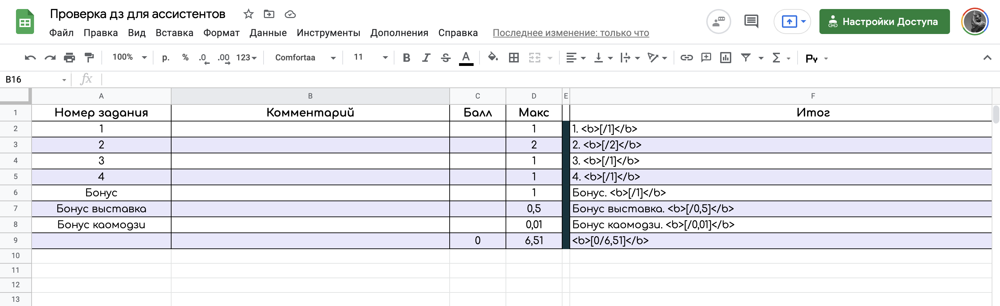
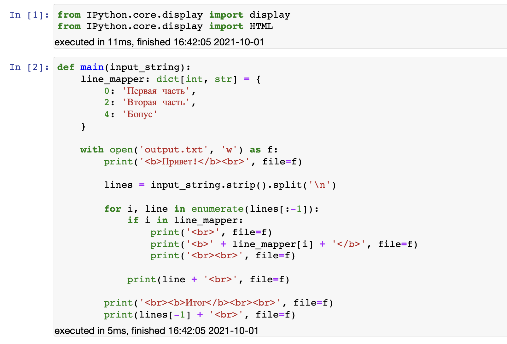
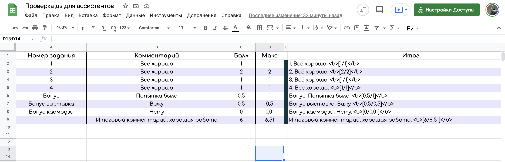
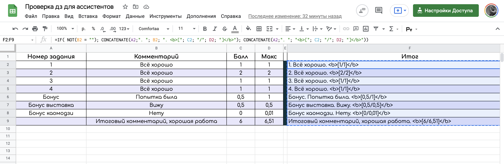
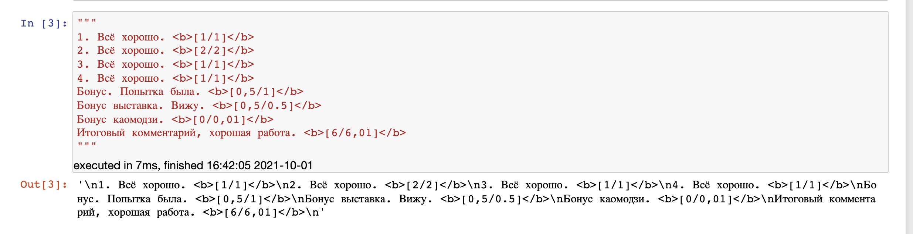
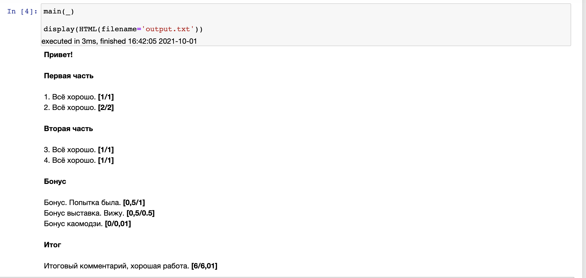

# Homework checking with style

Данный репозиторий предназначен для учебных ассистентов, которые хотят упростить проверку домашних заданий и комментирование каждого пункта в дз.

#### Преимущества использования:
1. Автоматический подсчет суммарного балла
2. Красивые, понятные и детальные комментарии по каждому пункту + баллы за каждый пункт
3. Унифицированные комментарии для каждого студента
4. Визуально приятный фидбек для студентов ☺️☺️☺️

### Инструкция по использованию

Перед началом использования репозитория рекомендуется скопировать себе [гугл-таблицу](https://docs.google.com/spreadsheets/d/1OQKD1KJvl7ImRY5GrDcve-4TPGDSFKiljVmtjU1YVW4/edit?usp=sharing).

#### Перед проверкой домашнего задания:
1. Заполняем свою копию [таблицы](https://docs.google.com/spreadsheets/d/1OQKD1KJvl7ImRY5GrDcve-4TPGDSFKiljVmtjU1YVW4/edit?usp=sharing) в соответствии с разбалловкой за задачи/пункты (см. пример).
2. Заполняем словарик `line_mapper` из ноутбука `checker.ipynb` в соответствии с логическим делением домашнего задания на части (см. пример).
3. Запускаем первые две клетки в ноутбуке `checker.ipynb` (выполнить импорты и задефайнить функцию).

#### Во время проверки домашнего задания:
1. После проверки конкретного пункта заполняем поле комментарий (или не заполняем, если нечего сказать) + ставим оценку.
2. После проверки всего домашнего задания копируем столбец `Итог` из таблицы (столбец F **без заголовка**).
3. Вставляем скопированный столбец в клетку ноутбука `checker.ipynb` между тройных кавычек.
4. Запускаем выполнение этой клетки и следующей клетки, которая рендерит наши комментарии в HTML.
5. Копируем вывод этой клетки и отправляем сразу в anytask.

### Примеры работы:

